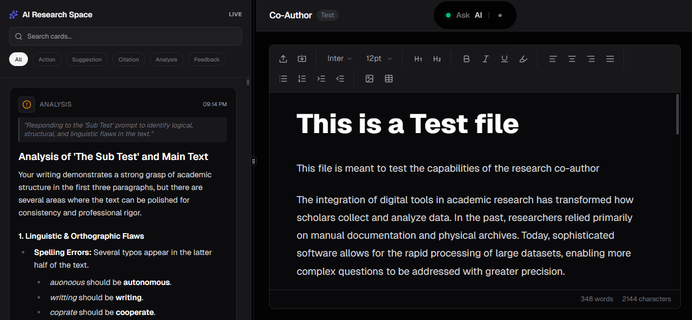

# Co-Author: The Disciplined AI Writing Partner - Autonomy First Approach

Co-Author is an experimental AI writing environment that treats the AI not as a tool, but as a **disciplined colleague**. It doesn't spam you with autocomplete suggestions. Instead, it observes your writing, thinks silently, and only interrupts when it has something valuable to say - **An Autonomous Writing Agent**.
### Project preview slides at the bottom.
---

## Public preview link
https://co-author.vercel.app/




##  Key Features

###  The Mature AI (7-Layer Stack)
We've engineered "restraint" into the AI. It uses a 7-layer decision stack to respect your flow:
- **Silence is Default**: It waits 3.5s after you stop typing before even *thinking*.
- **Justification**: It must justify to itself *why* a suggestion is worth breaking your concentration ("Value is Intelligence").
- **Cooldowns**: It won't bug you more than once every 30 seconds.
- **Shadow Prompting**: Want manual control? Just type `[Explain this concept]` on a new line.THis is a secondary input to interact with the Ai, allowing further control and desired output.
- **Full Control**: Use the **Pause Button** in the Dynamic Island to completely silence the AI when you need deep focus.

###  Built-in Security
- **Sanitized Inputs**: Protects against DoS and malformed data.
- **Intent Scanning**: Blocks malicious roleplay and jailbreak attempts.

###  Live Voice Co-Author
- **Active Listening**: The AI listens to your voice and "reads" your document in real-time.
- **Silent Context**: It observes your changes silently and only speaks when you ask for help.
- **Proactive Assist**: Can instantly write researched facts, citations, or suggestions directly to your sidebar on command.

###  Premium Editor Experience
- **Distraction-Free**: Minimalist interface focused on your words.
- **Smart Context Menu**: Right-click for AI powers (Cite, Paraphrase, Expand) or standard tools.
- **Persistent Sessions**: Your research and AI cards are saved automatically. Rename your session by clicking the title.

## Getting Started

1.  **Clone the repo**
2.  **Install dependencies**:
    ```bash
    npm install
    ```
3.  **Environment Setup**:
    Create a `.env` file with:
    ```
    GEMINI_API_KEY=your_key_here
    NEXT_PUBLIC_SUPABASE_URL=your_url
    NEXT_PUBLIC_SUPABASE_ANON_KEY=your_key
    ```
4.  **Run Development Server**:
    ```bash
    npm run dev
    ```

##  Tech Stack
- **Framework**: Next.js 14
- **AI**: Google Gemini 3 Flash Preview
- **Editor**: Tiptap
- **Database**: Supabase
- **Styling**: Tailwind CSS

## Contributing
This is a research project exploring Human-AI collaboration dynamics. Feel free to open issues or PRs if you have ideas on how to make the AI even smarter (or quieter!).

---

## Project Preview Slides
<!-- 13 slides -->


